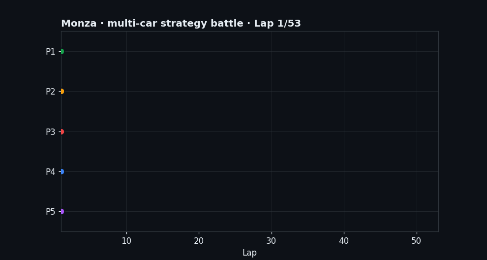

# F1 Race Strategy Engine

A physics-based Formula 1 lap-time simulator and **race-strategy decision engine**,
calibrated against real timing data (FastF1) and designed to answer the questions a
race-strategy team actually faces: not just *"which strategy is fastest on paper?"*
but *"which is most robust to a Safety Car?"* and *"the SC is out now — what do we do?"*.

The physics is the engine; the product is the **decision under uncertainty**.



*Five strategies, one race: positions are won and lost on pit timing and compound
choice (squares = pit stops), not raw pace alone. Generated by the multi-car
track-position model — reproduce with `python scripts/make_readme_gif.py`.*

---

## What it does

```
                 ┌─────────────────────────────────────────────────────────┐
                 │  Calibrated physics lap simulator (per-circuit, FastF1)  │
                 └─────────────────────────────────────────────────────────┘
                                          │
        ┌─────────────────────────────────┼─────────────────────────────────┐
        ▼                                 ▼                                 ▼
  DP strategy                     Dynamic weather                   Learned tyre
  optimiser                       model (Level A/B)                 degradation (ML)
  (exact optimum)                 from real race data               from real stints
        │                                 │                                 │
        └─────────────────────────────────┼─────────────────────────────────┘
                                          ▼
                    ┌───────────────────────────────────────────┐
                    │  Monte Carlo risk engine (SC/VSC stochastic)│  → P5/P50/P95, win-prob
                    └───────────────────────────────────────────┘
                                          │
                                          ▼
                    ┌───────────────────────────────────────────┐
                    │  Live re-optimiser (react to SC / rain now) │  → optimal pit call
                    └───────────────────────────────────────────┘
```

- **Lap simulator** — quasi-steady point-mass model (aero, friction circle, powertrain,
  ERS, tyre wear/thermal model) integrated over track segments.
- **Strategy optimiser** — exact dynamic-programming optimum over compound sequences and
  pit laps.
- **Weather model** — static (Level A), a per-lap dynamic timeline (Level B) reconstructed
  from real race data, or an **uncertain forecast (Level C)** whose rain timing and intensity
  are random; the optimiser chooses slicks / intermediates / full wets accordingly.
- **Weather Monte Carlo** — samples many timelines from an uncertain forecast and scores each
  strategy on **robustness to the forecast being wrong** (which slick plan survives a shower,
  whether an early-intermediate gamble pays off), reusing a precomputed lap-time-vs-wetness
  response surface so it stays as fast as the Safety-Car Monte Carlo.
- **Monte Carlo risk engine** — turns the single deterministic plan into a *distribution* by
  sampling Safety Cars and VSCs (with paired sampling / common random numbers for a fair
  win-probability), so strategies are compared on **robustness**, not just nominal time.
- **Live re-optimiser** — given the current race state and an event (Safety Car now, rain
  arriving), re-optimises the remaining race and returns the optimal pit call.
- **Multi-car race with track position** — N cars on the same circuit where on-track passes
  are hard (resistance scaled by the circuit's overtaking likelihood, e.g. Singapore ≈ 0.25
  vs Monza ≈ 0.43), so a faster car gets stuck in dirty air. The pit stop bypasses that
  resistance, making the **undercut** and **overcut** emerge naturally; every position change
  is detected and classified as undercut / overcut / on-track pass.

Machine learning is used **where data beats physics**: tyre degradation rates and Safety-Car
probabilities are *learned from real races*, not hand-tuned.

---

## Validation against real data

Everything is anchored to real 2024 sessions via [FastF1](https://github.com/theOehrly/Fast-F1).

| Check | Result |
|---|---|
| **Qualifying pace** (Bahrain) | sim vs VER pole **+0.08 s** |
| **Qualifying pace** (Silverstone) | sim vs NOR pole **−0.16 s** |
| **Qualifying pace** (Singapore) | sim vs NOR pole **+0.04 s** |
| **Race pace** (Monza, optimal strategy) | sim vs LEC **−0.55 s/lap** (consistent with the known tyre-management gap) |
| **Wet/mixed race** (Silverstone 2024, dynamic weather) | sim reconstructs HAM's real **Medium → Intermediate → Soft** strategy; race-pace **+0.71 s/lap** |
| **Strategy validation** (Monza 2024) | with degradation **learned from data**, the optimiser independently returns the **1-stop** that won the real race |
| **Live SC decision** (Monza, SC at L26) | recommends pulling the stop into the SC window, saving **8.3 s** = the analytical pit discount |
| **Safety-Car exposure** (Singapore) | Monte Carlo over historical SC rates: **81 % of races neutralised** (highest on the calendar); win-probability spreads across 4 strategies instead of collapsing onto one |
| **Live SC decision** (Singapore, SC at L20) | recommends pulling the stop from L25 to L23, saving **11.1 s** — larger than Monza because of the 28 s pit lane |
| **Track position** (Singapore multi-car) | with overtaking likelihood ≈ 0.25 the model produces **0 on-track passes** — every position change is an undercut or overcut, the real Marina Bay signature |
| **Forecast uncertainty** (Level C) | the response surface places the slick→inter→wet crossovers at the right wetness (inters fastest ≈ 0.4, full wets ≈ 0.8); the weather Monte Carlo is **exact at the nominal forecast** and shows how each plan degrades as the forecast is wrong |

### The strongest result: data correcting the model

The tyre-degradation rates were originally hand-tuned. Fitting them to real stint data
(fuel-corrected, robust Theil–Sen regression over 200–280 stints/circuit) revealed that the
**physics already reproduced the real degradation** (Monza Medium: physics 0.065 s/lap vs real
0.065), while the hand-tuned overlay was inflating it ~3×. Removing that overlay, the
optimiser **switched from a 2-stop to the 1-stop that Leclerc actually won on** — a strategy
error that the data exposed and corrected.

---

## Physics & engineering model

The lap simulator is a **quasi-steady point-mass** model integrated in **space**, not time:
the track is discretised into segments and the car is advanced segment by segment, solving the
force balance at each step. It is deliberately simple enough to be fully transparent and fast
(thousands of lap sims for the strategy search), but rich enough to reproduce real pace.

### 1. Spatial integration

For each step of length `ds`, the speed and elapsed time are advanced kinematically:

\[
v_{i+1}^2   = v_i^2 + 2\dot a \dot ds     \qquad       (a = net longitudinal acceleration)\\
dt          = ds / v_{avg}                \qquad       (v_avg = ½(v_i + v_{i+1}))\\
lap_{time}  = \sum dt
\]

A **backward braking pass** runs before each corner: starting from the corner's grip-limited
apex speed, it propagates the maximum speed from which the car can still brake in time
(`v_max² = v_apex² + 2·a_brake·ds`), so the car brakes early enough — the model never enters a
corner faster than it can physically slow down for.

### 2. Aerodynamics

```
q          = ½ · ρ · v²             dynamic pressure   (ρ = 1.225 kg/m³)
F_drag     = q · Cd · A             drag
F_downforce= q · Cl · A             downforce
```

`Cd`, `Cl`, `A` are per-circuit (Monza low-downforce, Silverstone high). A **dynamic aero
balance** shifts the centre of pressure forward under braking and rearward under
acceleration / high speed, feeding the front/rear load split.

### 3. Mass and vertical load

```
m(t) = m_car + m_fuel(t)            fuel burns ~per km → car gets lighter & faster over a stint
N    = m·g + F_downforce            vertical load on the tyres (grows with downforce at speed)
```

### 4. Grip and the friction circle

The core of the model. Maximum tyre force:

```
F_grip = μ · g_mult · N
```

- `μ` (`tyre_mu`) — tyre-friction coefficient, the **per-circuit calibration knob**.
- `g_mult` — combined grip multiplier = `wear × temperature × warm-up × weather` (≤ 1).
- `N` — vertical load (so downforce increases grip with speed).

Lateral and longitudinal demands share one budget (**friction circle**):

```
F_long_available = √(F_grip² − F_lat²)
```

If a corner already saturates grip laterally, no force is left to accelerate or brake — exactly
the real compromise between cornering and traction.

### 5. Cornering speed

```
F_lat = m · v² · κ                  κ = curvature = 1/radius (with banking term)
```

The maximum corner speed solves `μ·g_mult·N(v) = m·v²·κ` **iteratively**, because the vertical
load `N` itself depends on `v` through downforce. Each corner's curvature is derived from its
apex speed and lateral load in the circuit file: `κ = a_lat·g / v_apex²`.

### 6. Powertrain and ERS

```
T(rpm)              F1-style torque curve (rise → flat plateau → taper to rev limit)
F_wheel    = T(rpm) · gear_ratio · final_drive · η / r_wheel
F_power    = (P_max + P_ERS) / v        power-limited force
F_traction = min(F_wheel, F_power, F_grip)
a          = (F_traction − F_drag) / m  net longitudinal acceleration
```

The **MGU-K (ERS)** adds `ers_power_kw` only on straights (curvature = 0), where deployment
actually happens; 120 kW in qualifying mode, 0 in the race calibration (which already embeds it).

### 7. Tyres — wear, temperature, degradation

```
Δwear   = wear_rate_per_km · ds_km · thermal_multiplier
grip(wear): three-phase — gentle logarithmic drop, then a linear "cliff" past ~75 % wear
temperature: heating (load, accel, speed, cornering) − cooling (airflow); grip peaks at T_opt
warm-up: grip ramps to full over the first ~1.5 km of a new set
```

On top of the physics, an **empirical degradation overlay** `deg_s_per_lap × (laps_on_tyre − 1)`
captures the lap-time fade the grip model under-represents. **This overlay is learned from real
stint data** (Section *Tyre degradation* below), not hand-tuned.

### 8. Weather grip (wet model)

Track wetness `w ∈ [0,1]` scales grip per compound family, reproducing the real crossover:

```
slick:         max(0.30, 1 − 0.62·w)               best when dry, useless soaked
intermediate:  max(0.55, 1 − 1.6·(w − 0.40)²)      peaks on a damp track (~40 %)
wet:           max(0.50, 1 − 1.1·(w − 0.85)²)      peaks on a soaked track (~85 %)
g_mult ← g_mult × base_grip × wet_factor
```

- **Level A** — constant wetness for the whole race.
- **Level B** — a per-lap `WeatherModel` timeline (interpolated keyframes), so the track can dry
  out or get wetter mid-race. The optimiser then naturally switches slick → inter → wet.

### Data-driven components (machine learning where data beats physics)

- **Tyre degradation** (`tyre_deg.py`) — for every clean green-flag stint in 2019–2024 (real
  FastF1 data), lap times are fuel-corrected and a **robust Theil–Sen slope** gives the
  degradation rate; per-(circuit, compound) estimates are pooled with **empirical-Bayes
  shrinkage**, and the spread (after removing systematic car/era variance) feeds the Monte
  Carlo degradation noise. The model learns the *slope* (how the tyre fades), which is
  transferable; the absolute pace *level* stays the calibrated `tyre_mu`.
- **Safety-Car probability & duration** (`sc_history.py`) — counted from real per-lap
  `TrackStatus` across 2019–2024 and shrunk towards a global F1 prior (5–6 races/circuit is
  too few for raw frequencies).

### Per-circuit configuration (current calibration)

| Circuit | `tyre_mu` | Anchor | Weather | Degradation overlay (S / M / H) |
|---|---|---|---|---|
| Monza 2024 | **1.92** | race pace | dry | 0 / 0 / 0 (physics already ≈ real) |
| Silverstone 2024 | **1.85** | qualifying | **dynamic** (real 2024 mixed race) | 0 / 0 / 0 |
| Bahrain 2024 | **1.80** | qualifying | dry | 0.047 / 0.043 / 0.038 (abrasive → adds deg) |
| Singapore 2024 | **1.63** | qualifying | dry | 0 / 0 / 0 (smooth street → physics already ≈ real) |

Learned real degradation (fuel-corrected, s/lap): Monza ≈ 0.06 all compounds; Silverstone Soft
0.058 / Med 0.028 / Hard 0.024 / Inter 0.239; Bahrain Soft 0.14 / Med 0.12 / Hard 0.10.

---

## How to run

Install dependencies once:

```bash
pip install -r requirements.txt
```

**Web app** (interactive, browser-based — the quickest way to explore):

```bash
streamlit run app.py
```

A point-and-click front-end over the whole engine: pick a circuit, then explore
the strategy ranking, the Safety-Car risk scatter, an uncertain rain forecast
(Level C, with sliders) and the multi-car undercut / overcut battle. All heavy
computation is cached, so the controls stay responsive.

**Command line** (full control, interactive prompts):

```bash
python main.py
```

Non-interactive examples:

```bash
# Monza, dynamic-programming optimum + Monte Carlo robustness + dashboard
python main.py -c monza_2024 --dashboard

# Wet race: inject a dynamic weather timeline (lap:wetness keyframes)
python main.py -c silverstone_2024 --weather-timeline "1:0,26:0,29:0.6,36:0.4,40:0"

# Live strategy: a Safety Car is deployed at lap 26 — what's the optimal call?
python main.py -c monza_2024 --sc-lap 26

# Singapore: highest Safety-Car circuit — robustness and live SC reaction matter most
python main.py -c singapore_2024 --sc-lap 20

# Multi-car: undercut / overcut under sticky track position (hardest at Singapore)
python main.py -c singapore_2024 --multi-car --num-cars 4

# Level C: an uncertain rain forecast (prob, onset±std, peak±std, duration)
python main.py -c monza_2024 --weather-forecast "0.7,28±4,0.6±0.15,10"
```

The interactive dashboard (Plotly/Dash) has tabs for race strategy, lap telemetry, a lap
animation on the real GPS track, the FastF1 sim-vs-real comparison, the multi-car race, and
the Monte Carlo risk distribution.

---

## Architecture

```
app.py                           Streamlit web app (interactive front-end)
main.py                          entry point + CLI / TUI orchestration
src/
  models/        vehicle.py      point-mass vehicle: aero, grip, powertrain, ERS
                 tyre.py         compound wear/thermal/grip model + wet compounds
                 weather.py      WeatherModel + WeatherForecast (static / dynamic / uncertain)
                 strategy.py     RaceStrategy / RaceResult / Stint dataclasses
  simulation/    lap_simulator.py    spatial integrator → lap time + telemetry
                 race_simulator.py   full race for a strategy (+ per-lap weather)
                 monte_carlo.py      stochastic SC/VSC risk engine
                 weather_mc.py       forecast-uncertainty Monte Carlo (Level C)
                 multi_car_simulator.py  track position + undercut / overcut
  optimization/  strategy_optimizer.py   exact DP optimum
                 strategy_search.py      brute-force sampled search
                 live_reoptimizer.py     in-race re-optimisation
  data/          loaders.py      circuit YAML → Track / Vehicle setup
                 fastf1_loader.py    real telemetry / race laps / track maps
                 sc_history.py       Safety-Car probabilities from history (empirical Bayes)
                 tyre_deg.py         degradation learned from real stints
  visualization/ dashboard.py, *_plotter.py, fastf1_comparison.py, track_animator.py
scripts/         make_readme_gif.py  regenerates the header animation
data/tracks/     monza_2024.yaml, silverstone_2024.yaml, bahrain_2024.yaml, singapore_2024.yaml
tests/           pytest suite (163 tests)
```

### Methodology notes

- **Per-circuit calibration** uses a single tyre-friction coefficient `tyre_mu`, anchored to
  the real pole (qualifying-calibrated circuits) or race pace (Monza). This is a deliberate
  single-knob choice: it cannot match qualifying *and* race simultaneously, and that trade-off
  is documented per circuit.
- **Empirical-Bayes shrinkage** is used wherever data is thin (Safety-Car rate and duration,
  per-circuit degradation): estimates are pulled towards a global prior with a strength set by
  the sample size, avoiding noise from 5–6 races per circuit.
- **Common random numbers** make the Monte Carlo win-probability a fair paired comparison.

---

## Testing

```bash
python -m pytest tests/ -q
```

163 tests cover the physics (forces, friction circle, grip), the tyre and weather models
(including the wet/slick crossover), the loaders (including exact lap-length reconstruction),
the DP↔race-simulator coherence, the Monte Carlo (percentile ordering, win-probability
normalisation, degradation noise), the Safety-Car estimator, the degradation fitting, the
multi-car track-position model (undercut / overcut detection, overtaking resistance), and the
live re-optimiser (including its weather-awareness).

---

## Honest limitations

This is a portfolio model, not a works simulator. Known simplifications, documented rather
than hidden:

- **Quasi-steady point-mass** physics — no transient dynamics, no tyre slip curves.
- **Single `tyre_mu` per circuit** absorbs slipstream / energy management / traffic; it cannot
  match qualifying and race pace at the same time. The error surfaces wherever the circuit was
  *not* anchored: Monza is race-calibrated, so its lone-lap qualifying gap is large by design;
  Bahrain is qualifying-calibrated (pole +0.08 s), so its race pace runs ~4 s/lap faster than
  Verstappen's real race — which is the sum of his heavy tyre management (won by 22 s, cruising)
  and the model compressing the qualifying-to-race pace spread. The degradation itself is
  data-accurate; this is purely a pace-*level* (not pace-*slope*) limitation of the single knob.
- **Physics degradation is roughly circuit-independent** (~0.065–0.10 s/lap); the additive
  learned overlay can raise it (Bahrain) or zero it (Monza) but cannot *reduce* it below the
  physics floor (Silverstone slicks remain slightly over-degraded).
- **Weather is data-driven, not predictive** — the Level B timeline is reconstructed from a
  real race, not forecast. The Level C forecast is a *synthetic* uncertainty model (a single
  trapezoidal shower with Gaussian onset / intensity / duration), not a meteorological one; its
  lap-time response surface assumes the wet penalty is fuel-/age-independent (grip-dominated),
  which is why it is applied as a delta from the exact nominal timeline.
- **Race pace is "every lap on the limit"** — the ~0.5 s/lap gap to real managed races is the
  expected driver/tyre-management residual, not a model error.
- **Multi-car overtaking is a strategic abstraction** — track position is modelled at lap
  resolution (a pace-margin threshold scaled by circuit overtaking likelihood, plus a dirty-air
  gap), not corner-by-corner wheel-to-wheel racing. It is built to make undercut / overcut
  trade-offs emerge correctly, not to simulate individual passing moves or DRS trains in detail.

---

## Tech stack

Python · NumPy · SciPy · pandas · FastF1 · Plotly / Dash · pytest
